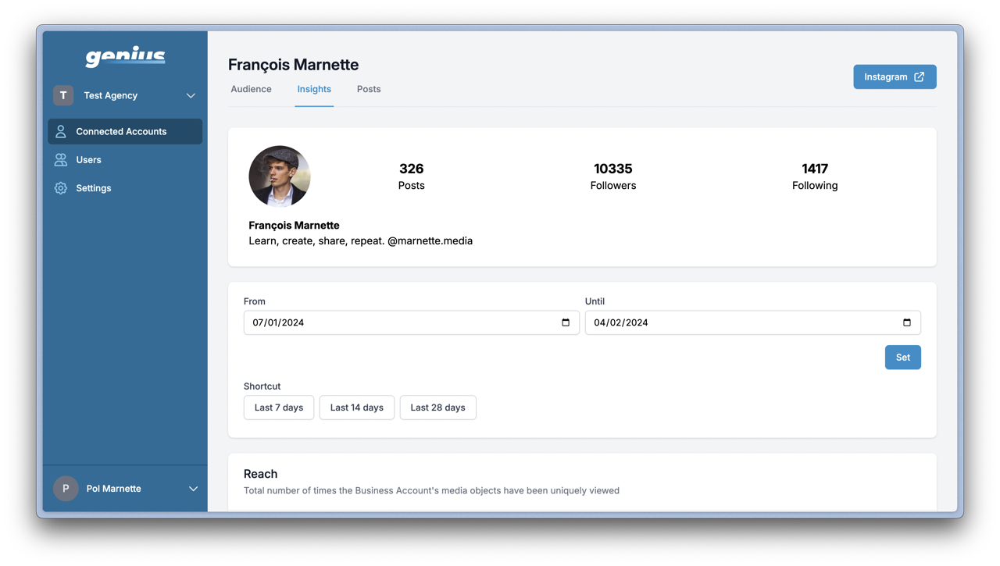
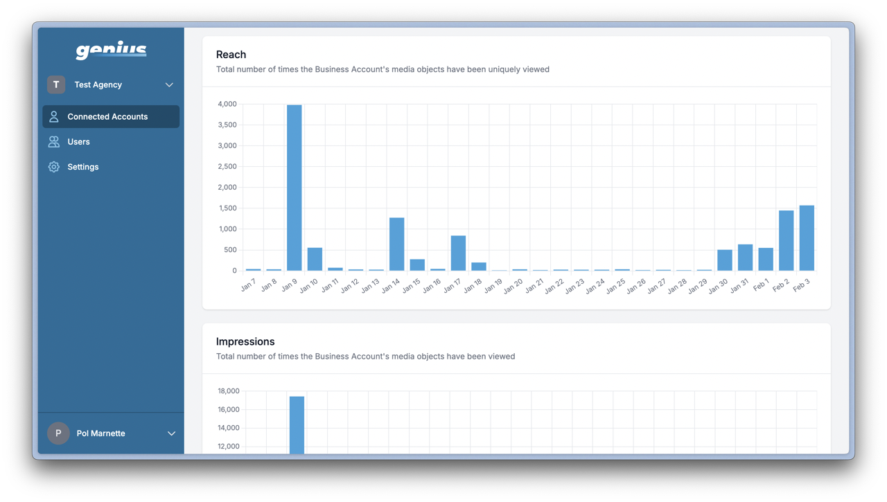
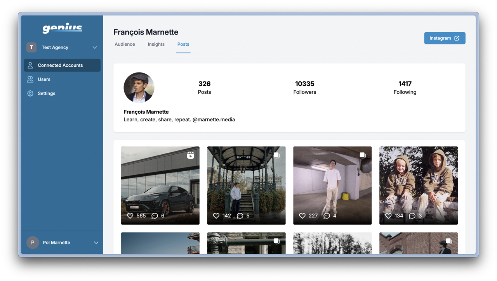

  <picture>
    <source media="(prefers-color-scheme: dark)" srcset="https://raw.githubusercontent.com/PolMrt/genius-social/main/.github/logo-dark.svg">
    <source media="(prefers-color-scheme: light)" srcset="https://raw.githubusercontent.com/PolMrt/genius-social/main/.github/logo-light.svg">
    
  </picture>

  Access multiple Instagram accounts' insights in one place.

---

> [!WARNING]  
> The status of this project is **unmaintained**.
> Meta refused all of our requests to access the Instagram API, that is the reason we decided to stop the development of this project and make it open source.

The goal of this project was to create a website to help agencies retrieving insights from their creators' Instagram account. It works by connecting Instagram account to a space and shows all the insights in that space.

This project goal was to extend the current website [genius.social](https://www.genius.social/).

## Preview of the website

## How it works

The website is built with React and uses the Instagram API to retrieve the data from the user's account. The user can connect his account to the website and then the website will retrieve the data from the user's account.

The process to do so is the following:

- The agency generate an unique link on the website
- The talent clicks on the link and connects his Instagram account to the website
- The website retrieves the data from the talent's account and displays it to the agency
